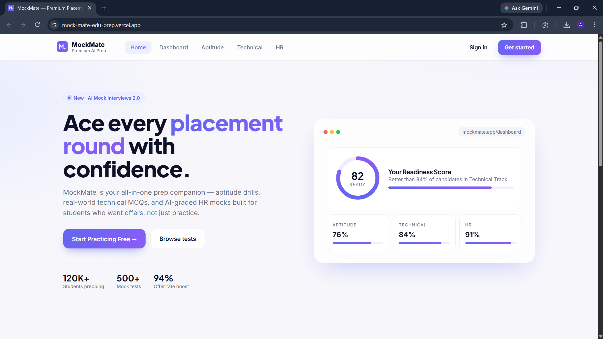
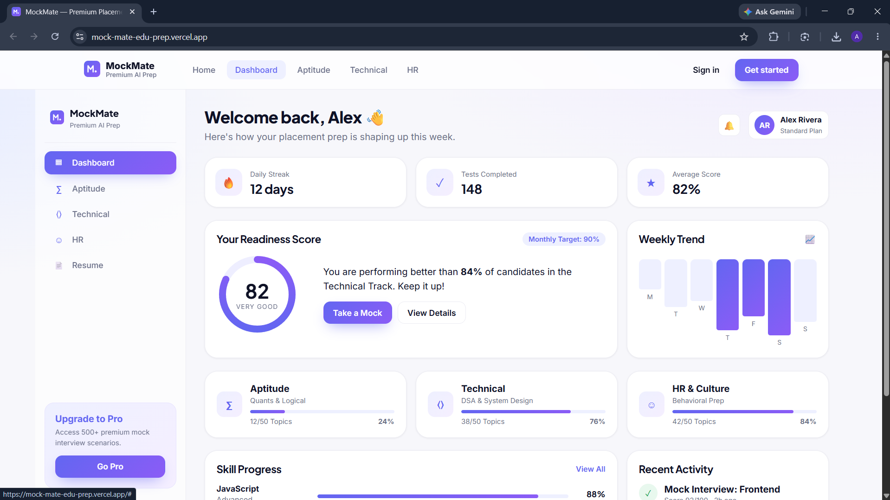
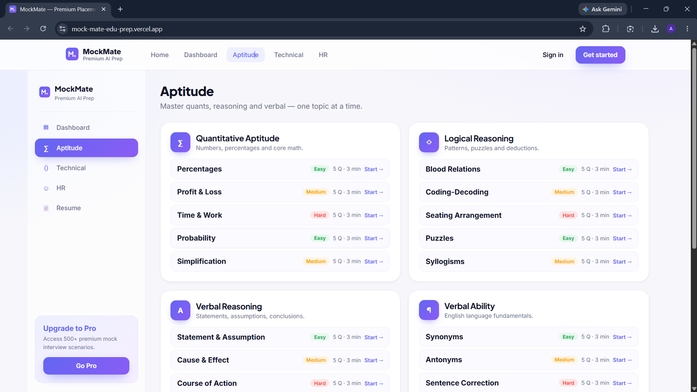
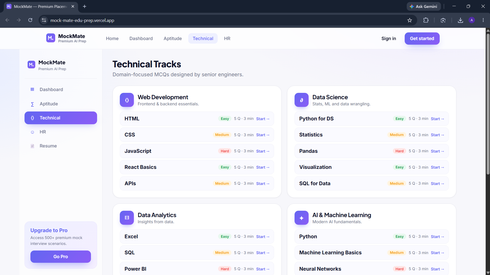
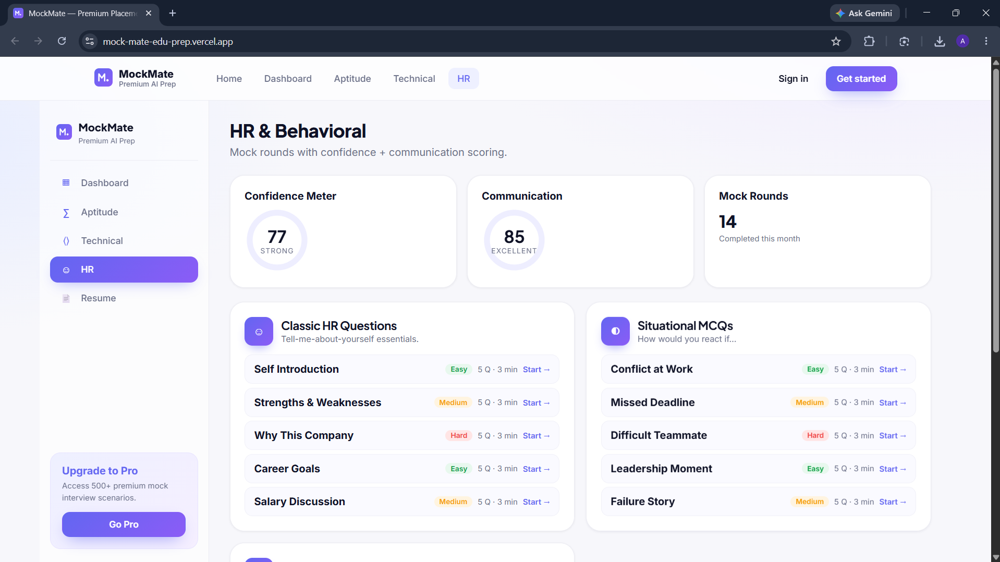
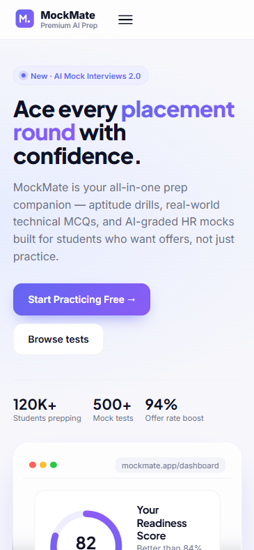

# MockMate — Placement Preparation Platform

---

## Overview

A modern and responsive placement preparation platform built to help students improve their aptitude, technical, and HR interview skills through interactive mock tests and performance tracking.

MockMate is designed with a student-friendly experience and a premium EdTech-style interface to simulate real placement preparation environments.

---

## Objective

To design and develop a professional placement preparation platform that helps students:

* Practice placement-oriented MCQs
* Track learning progress and performance
* Prepare for aptitude, technical, and HR rounds
* Improve confidence before interviews
* Access structured preparation resources in one platform

---

## Problem

Many students struggle during placement preparation because:

* Resources are scattered across multiple platforms
* There is no structured preparation flow
* Students lack proper mock test environments
* Progress tracking and performance analysis are missing
* HR preparation is often ignored

---

## Solution

MockMate provides a centralized placement preparation platform by:

* Offering categorized aptitude practice
* Providing technical MCQ-based preparation
* Including HR interview preparation modules
* Tracking student performance and progress
* Simulating real test experiences with timers and scoring systems

---

## Tech Stack

* HTML5
* CSS3
* JavaScript
* Local Storage

---

## Features

* Fully responsive modern UI
* Student dashboard with analytics
* Aptitude preparation section
* Technical preparation domains
* HR interview preparation
* Timer-based MCQ tests
* Progress tracking system
* Score calculation and analytics
* Smooth animations and transitions
* Mobile-friendly responsive layout

---

## Aptitude Preparation

Categories included:

* Quantitative Aptitude
* Logical Reasoning
* Verbal Reasoning
* Verbal Ability
* Non-Verbal Reasoning
* Share Your Experiences

Each category contains multiple topic-based MCQ practice tests with:

* Timer functionality
* Progress indicators
* Navigation controls
* Instant score calculation
* Result analysis

---

## Technical Preparation

Domains included:

* Web Development
* Data Science
* Data Analytics
* Artificial Intelligence & Machine Learning
* Cybersecurity

Features:

* Topic-wise MCQ assessments
* Difficulty indicators
* Technical practice rounds
* Performance tracking
* Interactive quiz interface

---

## HR Preparation

The HR module helps students prepare for interview rounds through:

* Domain-based HR questions
* Situational MCQs
* Confidence-based practice
* Communication-focused questions
* Feedback and scoring system

---

## Sections

* Landing Page
* Student Dashboard
* Aptitude Section
* Technical Section
* HR Interview Section
* Progress Analytics
* Quiz Interface

---

## Future Improvements

### Authentication System Upgrade

Planned future updates include:

* Sign In / Sign Up functionality
* Google Authentication
* Personalized dashboards
* Secure user sessions
* Email notifications and welcome emails

### Resume Booster (Upcoming)

Future versions will include:

* AI-powered resume analysis
* ATS score checker
* Resume improvement suggestions
* Skill gap recommendations
* Resume optimization system

### Additional Planned Features

* AI mock interviews
* Voice-based interview practice
* Leaderboards
* Daily challenges
* Company-specific preparation
* Personalized recommendations

---

## Live Deployment

Vercel Deployment:
https://mock-mate-edu-prep.vercel.app/

---

## Repository

GitHub Repository:
https://github.com/AkshayaKrishnan18/MockMate-EduPrep

---

## Preview

---

## Setup

Clone the repository and open `index.html` in a browser.

---

## Key Learning

* Building scalable frontend applications
* Designing student-focused user experiences
* Implementing dynamic quiz systems
* Managing progress tracking using JavaScript
* Creating responsive and interactive dashboards
* Structuring real-world EdTech platforms

---

## Contact

* Email: [akshayakrishnan1810@gmail.com](mailto:akshayakrishnan1810@gmail.com)
* GitHub: https://github.com/AkshayaKrishnan18
* LinkedIn: https://linkedin.com/in/akshaya-krishnan-98722b294

---

## Author
Akshaya SK
